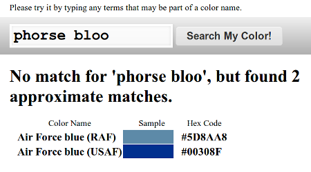

Fullproof is a javascript library that provides high-quality full-text search in the browser.

This specially makes sense if your webapp is designed to work offline, using the HTML5 offline feature or because your
application runs on a possibly disconnected mobile device.

### Features

* Boolean and Scoring search engines available, depending on the kind of search your application needs
* Automatic HTML5 storage detection, and graceful degradation, with a configurable constraint-based capabilities system. Currently manages WebSQL, IndexedDB and Memory data storage.
* Full unicode support and normalization, diacritical marks removal, stemming and phonetical algorithms (currently available for english and french)
* Configurable and very easely extensible parsing and token normalization system
* Easy to integrate, zero external dependency, ~100k minified

Note the fullproof is NOT a document management system, it does only one thing: provide fulltext search to your application, it does not aim at storing documents or data.

### Some Screenshots

A few screenshots from the examples.

### Want more information ?

* Try the samples
    * Colors : [search colors by name](examples/colors/colors.html) using a BooleanEngine hooked on metaphone
    * Animal Species: [search US animal species](examples/animals/animals.html), uses the fullproof BooleanEngine
    * Mame: [search the huuuge MAME ROM list](examples/mame/mamesearch.html) using the fullproof ScoringEngine
* [Read the tutorial](tutorial.html)
* [Visit the wiki for more documentation](https://github.com/reyesr/fullproof/wiki) or [the generated JSDOC](jsdocs/index.html)
* [Visit the GitHub repository](https://github.com/reyesr/fullproof)
* [Download at GitHub](https://github.com/reyesr/fullproof/downloads)
